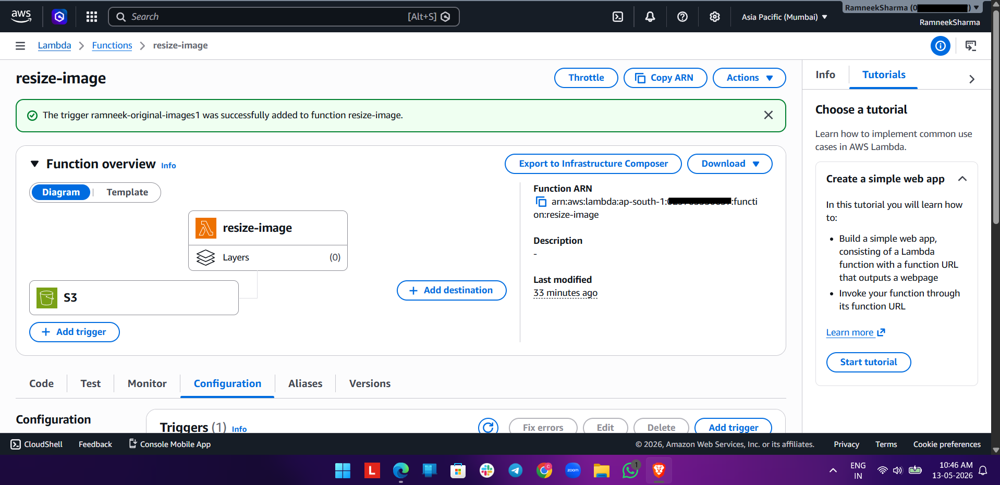
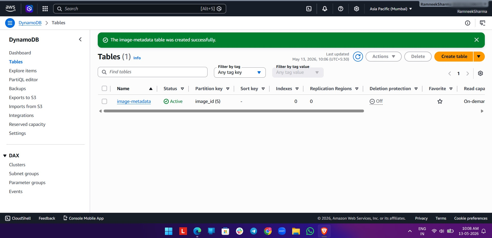
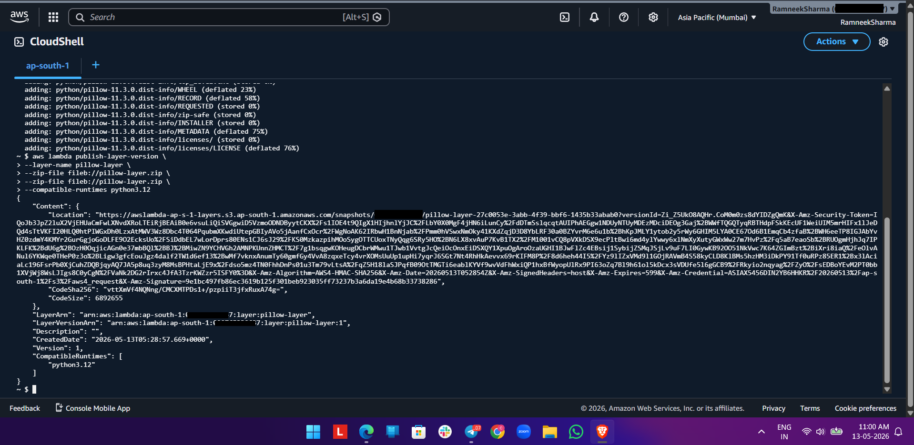
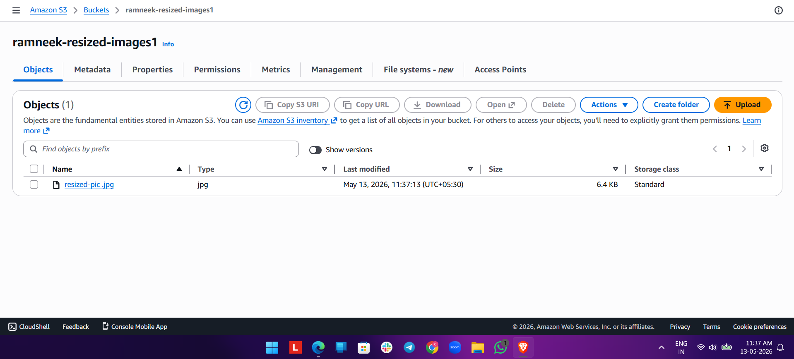

# AWS Serverless Image Processing Pipeline

## Project Screenshots

## Lambda Function

## DynamoDB Table

## Code

## Final Output

## Overview

This project is a serverless image processing pipeline built using AWS services.

When an image is uploaded to Amazon S3:

- AWS Lambda automatically triggers
- Image gets resized using Pillow
- Resized image is stored in another S3 bucket
- Metadata is stored in DynamoDB

---

## AWS Services Used

- AWS Lambda
- Amazon S3
- DynamoDB
- IAM
- CloudWatch
- Lambda Layers

---

## Technologies

- Python
- Boto3
- Pillow

---

## Architecture

S3 Upload → Lambda Trigger → Image Resize → Store in S3 → Save Metadata in DynamoDB

---

## Features

- Event-driven architecture
- Serverless automation
- Automated image resizing
- Metadata management
- Cloud-native workflow

---

## Author

Ramneek